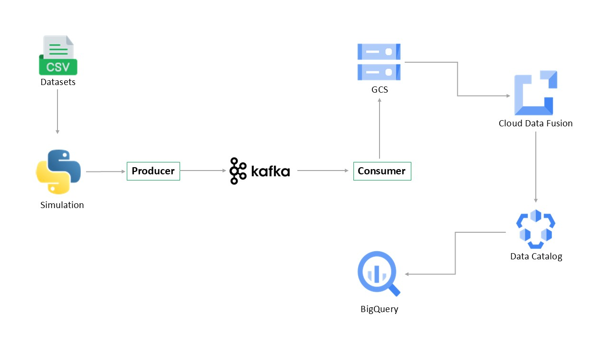

# Stock Market Kafka Real-Time Data Engineering Project  

## Introduction  
This project focuses on **building a real-time data pipeline** for stock market data using **Apache Kafka** on **Google Cloud Platform (GCP)**. The pipeline streams stock market data, processes it in real time, and stores it for further analysis.  

The goal is to handle **high-velocity data** efficiently and enable **real-time analytics** using **BigQuery**. The project simulates a real-world data engineering workflow, integrating multiple cloud services for seamless data processing.  

We will use **Kafka for event streaming**, **Google Cloud Storage for data storage**, **BigQuery for analytics**, and **Cloud Functions for automation**.  

## Architecture  

## Technology Used  
- **Programming Language** - Python  
- **Google Cloud Platform (GCP)**  
  1. Cloud Storage (for storing raw data)  
  2. BigQuery (for querying and analyzing data)  
  3. Cloud Functions (for automation)  
  4. Compute Engine (for running Kafka brokers)  
- **Apache Kafka** (for real-time data streaming)  

## Dataset Used  
You can use any dataset, as we are mainly focused on building the data pipeline.  

Here is the dataset used in the project -  